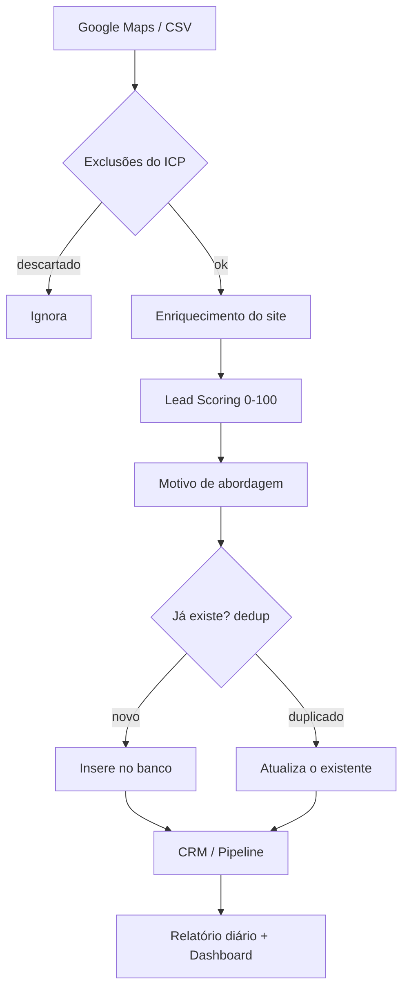

# SDR IA — Sistema de Prospecção (Fase 1: Núcleo)

Sistema para uma agência de marketing **encontrar, qualificar e organizar leads B2B**.
Esta é a **Fase 1** — o núcleo que já funciona de ponta a ponta.

👉 **Não sabe por onde começar?** Leia o **[GUIA-INSTALACAO.md](GUIA-INSTALACAO.md)**.
👉 **Já instalado?** Veja o **[GUIA-USO.md](GUIA-USO.md)**.
👉 **Colocar online (com login, acessível de qualquer lugar)?** Veja o **[DEPLOY.md](DEPLOY.md)**.

---

## O que está incluído nesta fase

| Módulo | O que faz |
|---|---|
| **lead_finder** | Busca no Google Maps (Places API oficial) + importação de CSV |
| **lead_enrichment** | Analisa o site (SEO, Meta Pixel, Analytics, Ads, HTTPS, velocidade) |
| **lead_scoring** | Nota de 0–100 com justificativa |
| **opportunity** | Motivo de abordagem (a "deixa" para o contato) |
| **crm** | Pipeline de vendas com transições válidas |
| **reporting** | Relatório diário |
| **database** | SQLite + **regra de deduplicação** |
| **dashboard** | Painel visual (Streamlit) |
| **error_handler** | Logging + retry automático |

**Fora desta fase (próximas):** envio de WhatsApp, follow-ups automáticos, agendamento,
Google Agenda e notificações. Veja o fim do GUIA-USO.

---

## Decisões de arquitetura (e por quê)

- **Captação só por fontes legais/estáveis:** Google Places API (oficial) e CSV.
  Scraping de Instagram/LinkedIn foi **descartado** — viola os termos dessas plataformas,
  quebra com frequência e arrisca banir contas.
- **Banco que funciona local E na nuvem:** SQLite no seu PC (arquivo único, zero servidor)
  e PostgreSQL quando online — o mesmo código atende aos dois (camada de dados via SQLAlchemy).
  Basta definir `DATABASE_URL` para usar Postgres.
- **Login de verdade:** tela de usuário/senha (streamlit-authenticator). Credenciais ficam
  no `auth_config.yaml` (local) ou nos Secrets do Streamlit (nuvem) — nunca no código.
- **Sem Docker / sem Playwright nesta fase:** roda direto no Windows com 2 cliques.
- **Lógica de negócio separada do painel:** os módulos em `backend/` não dependem do
  Streamlit, então são testáveis e reutilizáveis pelas próximas fases.

---

## Fluxo de um lead



---

## Estrutura do projeto

```
sdr-ia/
├─ backend/
│  ├─ config/config.py        # .env + config.yaml
│  ├─ database/               # db.py, schema.sql, repository.py (dedup)
│  └─ modules/                # lead_finder, enrichment, scoring, opportunity, crm, reporting, error_handler
├─ dashboard/app.py           # painel Streamlit (com login)
├─ dashboard/auth.py          # tela de login
├─ tools/set_password.py      # gera usuário/senha
├─ tests/                     # 22 testes (pytest) + smoke_e2e.py
├─ config.yaml                # suas preferências
├─ install.bat                # instala tudo (1x)
├─ configurar-login.bat       # define usuário/senha (1x)
├─ run-dashboard.bat          # abre o painel
├─ GUIA-INSTALACAO.md
├─ GUIA-USO.md
└─ DEPLOY.md                  # publicar online (grátis, com login)
```

---

## Para desenvolvedores

```bash
pip install -r requirements.txt
pytest -q                       # roda os 22 testes
python tests/smoke_e2e.py       # teste ponta a ponta com o banco real
python tools/set_password.py    # cria usuário/senha de login
streamlit run dashboard/app.py  # abre o painel (pede login)
```

Variáveis de ambiente:
- `GOOGLE_PLACES_API_KEY` — opcional; sem ela, use CSV.
- `DATABASE_URL` — opcional; se definida (Postgres), usa nuvem; senão SQLite local.
